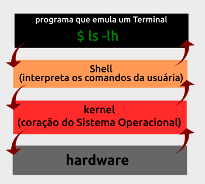

# Observações importantes

Para fins de estudo, criei este documento para que possa estudar de maneira rápida o uso de CLI linux.

# Tópico 103.1 Trabalhar com linha de comando

## Estudos do shell bash
Interpretador de linha de comandos e executar caso exista, primeiro ele analisa e depois produz um resultado na tela com base no comando informado.

### Executar mais de um comando em uma linha
Atravez da flat ```;``` é possivel adicionar mais comandos na mesma linha

Ex: ```cat /proc/cpuinfo ; ls /boot ; mount```

### AND lógico e OR lógico
AND: Primeiro comando precisa ser realizado com sucesso para o segundo ser executado ```&&```<br/>
EX: ```ls /proc && cat /etc/passwd && cat/etc/group```

Neste caso os dois comandos são executados.
---

OR: So executa segundo comando se o primeiro der erro ```||```<br/>
EX: ```ls /pro && cat /etc/passwd && cat/etc/group```

Neste caso como há um erro de digitação na palavra proc, primeiro comando não é realizado.

### Recurso de subtituição de comandos
Representado por \`comando` ou ${"{comando}"}<br/>
Util para poder inserir parte de um comando dentro de outro comando

Caso queira saber qual pacote instalou determinado arquivo:

#### Com dois comandos
Ex: 
`which ipconfig` -> Localiza onde está o comando<br/>
`rpm -qf /sbin/ifconfig` -> Retorna o nome do pacote que instalou o arquivo

----

#### Com um comando
EX: 
`rpm -qf ${which ifconfig}` -> Shel identifica o recurso interno e executa antes do externo retornando a mesma informação


### Tipos de comandos básicos

Internos (Builtins): Comandos que fazem parte do interpretador do bash.

Externos: Comandos que são armazenados no HD, precisam ser informados seu caminho absoluto.



```type``` + algum comando -> Verifica se o comando passado é interno ou externo.

```chsh``` -l -> Lista todos os shells presente no sistema.<br/>
obs: o mesmo resultado pode ser visto usando; ```cat /etc/shells```.

```alias``` -> Permite verificar os apelidos para comandos.<br/>
Ex: ```alias disco_free="df -hT"``` 

### Comandos de históricos

Existe um recurso de terminal que armazena todos os comandos digitados a fim de facilitar o reuso dos mesmos, usando as ↑ ou ↓.
Este arquivo fica armazenados em um arquivo localizado no perfil do usuário no `/root`.

## Comandos

```history``` -> Mostra os comandos usandos, ficam armazenados no **bash/history**.

```!11``` -> Executa o comando com base na linha do arquivo **history**.

```!i``` -> Executa o ultimo comando usando com a letra I.

```history -c``` -> Apaga o historico de comandos.

`$HISTFILE` -> Variavel de ambiente que mostra onde que estão armazendos o historico de comandos do usuário

`$HISTSIZE` -> Variavel que define a quantidade maxima que será armazenada na memória.

`$HISTFILESIZE` -> Variavel que mostra o número maximo que ficarão armazenado no history.

## Variavéis

Importante saber que variaveis nao podem iniciar com números ou inicia com uma letra ou um com (_) underline

### Iniciando variaveis 

`_aluno='Francisco'`

Para ler a variavel podemos usar o comando `echo` para visualizacao deste valor

`echo $_aluno`

Importante saber que as variaveis criadas ficam no scopo no terminal criado, caso deseje que seja visualizado em outro terminal, você precisa exportar a mesma.<br/>
Para remover a variavel utilize o comando `unset`

`unset _aluno`

## Comando set
Permite ver as variaveis locais e globais do sistema na seção

## Comando env
Semelhante ao set mas so mostra as variaveis globais

## PS1 e PS2
Armazena o prompt primario e secundario respectivamente. Importante saber que ao identificar o caractere `#` no final do seu prompt é um indicativo de usuário root do sistema.

**Alterado os valores dessas variaveis**

`PS1='<<\u@h: \w >>\$'`

\u -> usuário atual da maquina
\@h -> Inficativo de que pertence ao hostname da máquina
\w -> Retorna o path da máquina
\$ -> Se for root retorna # caso não um $

[Para mais informações acesse a página](https://cursos.alura.com.br/forum/topico-alterando-configuracao-do-prompt-178131)

## Uname
Retorna alguns valores referente ao sistema como o nome da maquina, versão do kernel, do sistema

### Variações do Uname

`uname -m` -> Retorna a arquitetura da maquina

`uname -p` -> Retorna a arquitetura do processador

`uname -n` -> Retorna o nome da máquina

`uname -a` -> Retorna todas as informações

## Trabalhos na linha de comando

### man

Caminho de armazenamento:<br/>
**/usr/share/man/**

`man` -> comando responsavél por retornar o manual do comando solicitado
ex:<br/>
`man pwd` -> Consulta a documentação do comando pwd

`man 1` -> Executaveis do comando shell<br/>
`man 2` -> Chamadas de sistema<br/>
`man 3` -> Chamadas de biblioteca<br/>
`man 4` -> Arquivos de dispositivos<br/>
`man 5` -> Arquivos de configuracões e convenções<br/>
`man 6` -> Jogos<br/>
`man 7` -> Variados (Pacotes macros e convensões)<br/>
`man 8` -> Administração do sistema<br/>
`man 9` -> Rotinas do kernel<br/>

Importante saber que caso não informe qual manual, ele procura na primeira seção que ele achar

### which

Exibe a localização do comando retornando seu caminho $PATH

### whatis

Identifica o manual de referência para o termo

`whatis uname`

```bash
uname (1)            - print system information
uname (2)            - get name and information about current kernel
```

Mesmo retorno é valido caso seja usado o comando `man -f uname`

### Apropos

Localiza um determinado comando com base no que você escreve por saber parte dele o retorno é com base no que você passou

`apropos ldap`

```bash
ldap.conf (5)        - LDAP configuration file/environment variables
URI::ldap (3pm)      - LDAP Uniform Resource Locators
```

`man -k ldap` da mesma forma que o apropos retorna o que você escreve.

### whereis

Busca por um termo ou comando especifico, retorna os manuais e os binarios.

`whereis iptables`

```bash
iptables: /usr/sbin/iptables /usr/share/iptables /usr/share/man/man8/iptables.8.gz
```

Retorno conforme esperado, mostrou qual manual e onde esta seus arquivos binarios.